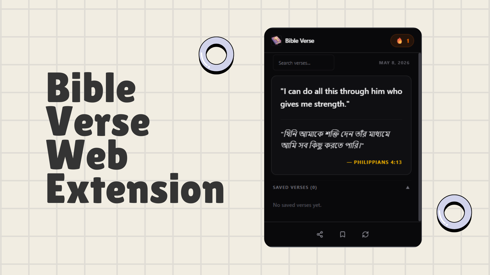

# Bible Verse Web Extension — Frontend

A simple browser extension that delivers random Bible verses daily in Bangla with English translation, bringing peace and comfort to your day.

---

## What It Does

📖 Displays a Random Bible verse daily in your browser pop-up <br>
🔍 Search verses by keyword <br>
💾 Save and share your favorite verses <br>
⚡ Fast, lightweight, and distraction-free <br>

---

## Tech Stack

| Tool | Purpose |
|------|---------|
| React + TypeScript | User Interface & type safety |
| Vite | Fast builds |
| Tailwind CSS | Styling |

---

### Install Dependencies

```bash
npm install
```

### Run in Dev Mode (Web Preview)

```bash
npm run dev
```

### Build for Production

```bash
# Standard web build
npm run build

# Chrome Extension build
npm run build:extension
```

---

## Getting Started

1. Run `npm run build:extension`
2. Open `chrome://extensions/` in Chrome
3. Enable **Developer Mode** (top-right toggle)
4. Click **Load unpacked**
5. Select the `dist/` folder

That's it - the extension icon will appear in your toolbar.

---


## Roadmap

-  Push notifications for daily reminders
-  User accounts + cloud sync
-  AI-powered verse recommendations
-  AI bot that explains the verse
-  Performance tuning (memoization, caching)

---

## Contributing

1. Fork the repo
2. Create a feature branch: `git checkout -b feature/my-feature`
3. Build and test in Chrome using the **Load unpacked** flow above
4. Submit a pull request
